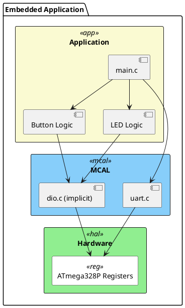
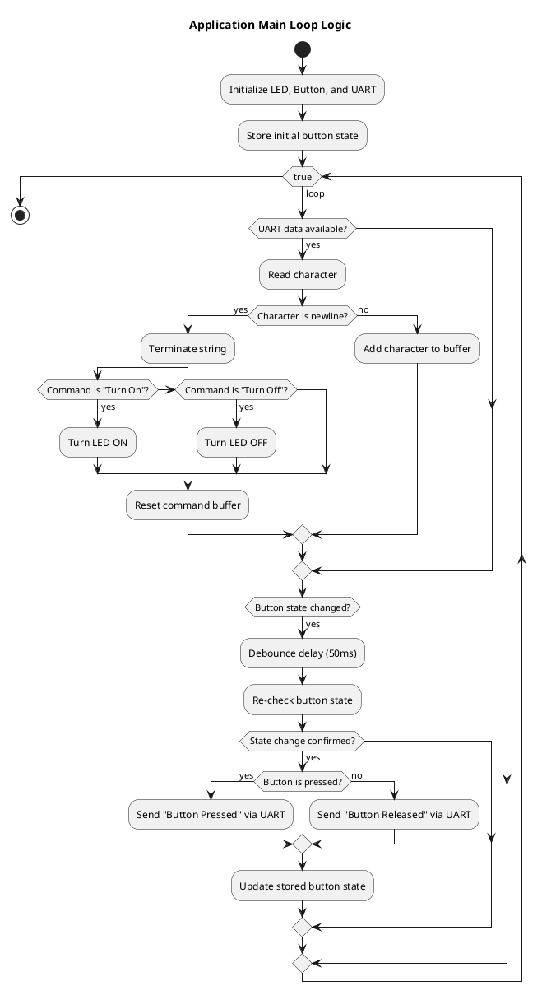
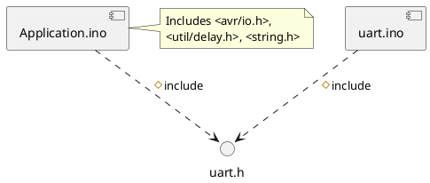

# ControlPoint

| **Author**              | `Ali Eliwa`                                       |
|:------------------------|:-----------------------------------------------------|
| **Status**              | `Draft`                          |
| **Version**             | `1.0`                                                |
| **Date**                | `18/10/2025`                                         |

## Introduction

This document provides the detailed software design for the "Data Acquisition over Network" project, which is Element 1 of the KH5023FTE Embedded System Design & Development module coursework. The system is developed for the AVR ATmega328P microcontroller.

### Purpose
This project aims to develop a dependable embedded system that uses the UART protocol to facilitate communication between a microcontroller and a PC. The system's purpose is to:

 1. Determine if a push button is in the pressed or released condition and alert a linked PC of any changes.

 2. Get precise string instructions from the computer to control a digital output (an LED).

 This provides a hands-on example of data collecting and control, similar to industrial applications like in-vehicle networking and control systems. 
### Scope
According to the project brief, this design's scope is limited to two main use cases:

Use Case #1: Transmission of Button States: The system will continuously monitor a digital button. When it detects a press or release, it will send the appropriate message to the PC via UART ("Button Pressed" or "Button Released").

Use Case #2: Using UART Commands to Control LEDs. When UART data arrives, the system will listen for it. A special command called "Turn On" will cause it to activate an LED. It will switch off the LED when it gets the "Turn Off" command.

Native C programming must be used to complete the project; no external libraries or Arduino-based code may be used. 

## Architectural Overview

The software architecture follows a layered approach to separate the application logic from the low-level hardware drivers. This enhances modularity and maintainability. The main layers are the Application Layer and the Microcontroller Abstraction Layer (MCAL).

### Assumptions & Constraints
Hardware: The target microcontroller is an AVR ATmega328P operating at a clock speed of 16 MHz.

Programming Language: The project must be implemented strictly in Native C.

Dependencies: No external libraries or Arduino-specific functions are permitted.

Development Tools: Code must be managed in a Git repository, and this design document must use PlantUML for diagrams.

## Functional Description
The system's main function is an infinite loop that controls its essential functionality.  The two primary functions of this loop are to continuously check for changes in the button's state and for incoming UART data.

#### Application Logic Flow

### UART Module Functionality
The UART module is responsible for all serial communication.

- Initialization (uart()): Configures the UART peripheral by setting the frame format to 8 data bits and enabling the transmitter and receiver20. It is also called baudrate(), which sets the communication speed.

- Baud Rate Calculation (baudrate()): The baud rate is set by calculating the appropriate value for the UBRR0 register based on the system clock F_CPU and the desired BAUD rate. The formula used is $UBRR = \frac{F_{CPU}}{16 \times BAUD} - 1$.

- Data Transmission (char_send, send): To send data, the code waits for the transmit buffer to be empty (UDRE0 flag) before writing the new character to the UDR0 data register21.

- Data Reception (read_data): The code waits until the receive complete flag (RXC0) is set, indicating that a character has been received and is ready to be read from the UDR0 register22.

## Implementation of the Module
The implementation is divided into logical files that separate the UART driver from the main application logic.

### Static Files
Typically a module consists of C and H files but other file types may exist. List all files that form this module

| File name | Contents                             |
|-----------|--------------------------------------|
| Application.ino | Contains the main application logic, including the main loop, button handling with debouncing, LED control functions, and UART command processing.         |
| uart.ino     | Contains the source code for the UART driver, including functions for initialization, setting the baud rate, and transmitting/receiving characters.                |
| uart.h    | The header file for the UART module. It provides the function prototypes for the public interface of the UART driver, allowing Application.ino to use them. |

### Include Structure
The Application.ino file is the main entry point and depends on the uart.h header to access the serial communication functions.

### Configuration
The system has several compile-time configuration parameters defined using #define macros. These can be adjusted before compiling the code.
| Name | Value range | Description |
|------|-------------|-------------|
|   F_CPU   |     Unsigned Long        | Defines the microcontroller's clock speed in Hz. It is crucial for delay functions and baud rate calculation.            |
|   BAUD   |    Unsigned Integer         |    Defines the desired baud rate for serial communication in bits per second.         |
|   LED_PIN   |DDB5, PORTB5             |     The pin connected to the LED. Configured as an output.        |
|   BUTTON_PIN   |  DDD2, PIND2           |     The pin connected to the button. Configured as an input with an internal pull-up resistor enabled.        |
